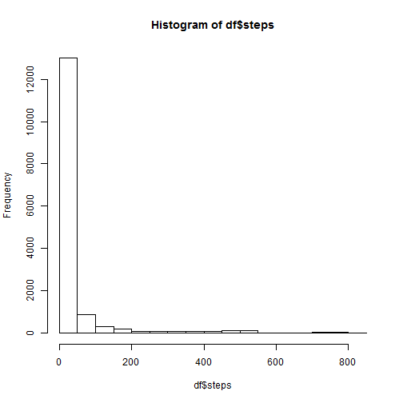
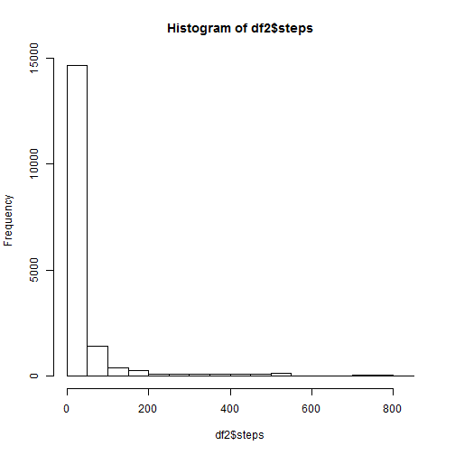
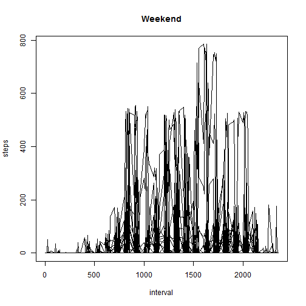
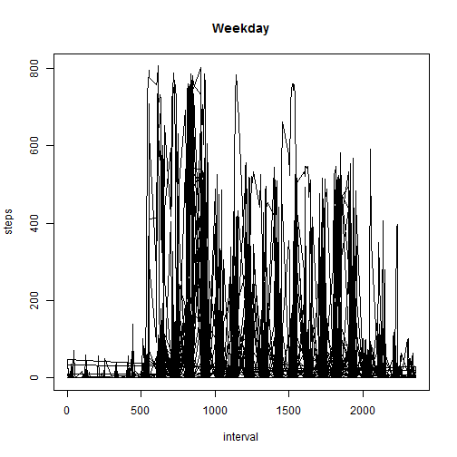

## Loading and preprocessing the data

```r
df <- read.csv("activity.csv")
```
## What is mean total number of steps taken per day?

```r
hist(df$steps)
```

 

```r
mean(df$steps,na.rm=TRUE)
```

```
## [1] 37.3826
```

```r
median(df$steps,na.rm=TRUE)
```

```
## [1] 0
```
## What is the average daily activity pattern?

```r
activity <- aggregate(df[c("steps")],by=df[c("interval")],FUN=mean,na.rm=TRUE)
plot(activity,type="l")
```

 

```r
activity[activity$steps==max(activity$steps),"interval"]
```

```
## [1] 835
```
## Imputing missing values

```r
length(which(is.na(df$steps)))
```

```
## [1] 2304
```

```r
df2 <- df
df2$steps <- ifelse(is.na(df2$steps),activity$steps[match(df2$interval, activity$interval)], df2$steps)
hist(df2$steps)
```

 

```r
mean(df2$steps)
```

```
## [1] 37.3826
```

```r
median(df2$steps)
```

```
## [1] 0
```
## Are there differences in activity patterns between weekdays and weekends?

```r
df2$wd <- as.factor(ifelse(weekdays(as.Date(df2$date)) %in% c("Saturday","Sunday"), "Weekend", "Weekday"))
plot(df2[df2$wd=="Weekend",c("interval","steps")],type="l")
title("Weekend")
```

 

```r
plot(df2[df2$wd=="Weekday",c("interval","steps")],type="l")
title("Weekday")
```

 
